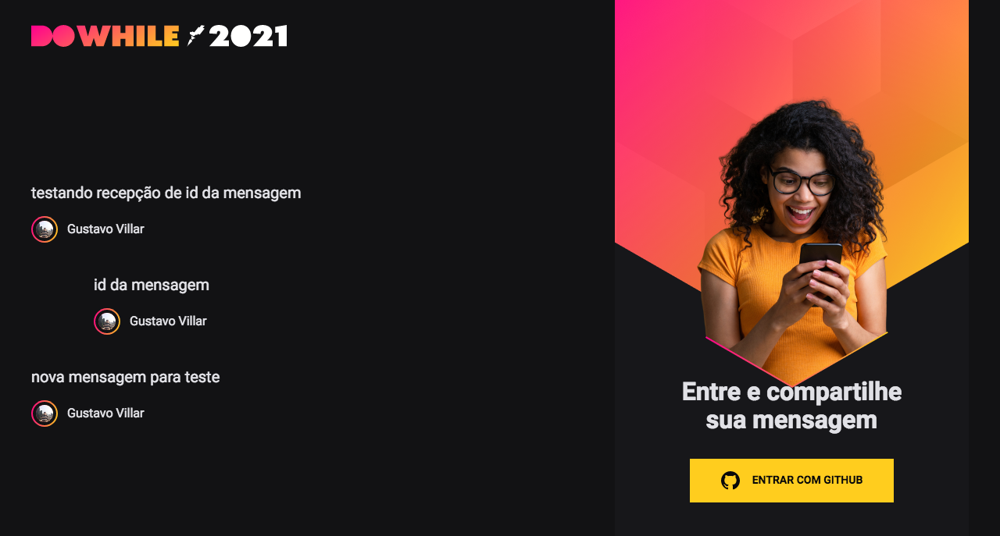

# NLW7 - Front-End

This is a solution to the front end application created by [rocketseat](https://www.rocketseat.com.br/) for NLW7. This challenge help you improve your coding skills by building realistic application.

## Table of contents

- [Overview](#overview)
  - [The challenge](#the-challenge)
  - [Screenshot](#screenshot)
  - [Links](#links)
- [My process](#my-process)
  - [Built with](#built-with)
  - [What I learned](#what-i-learned)
  - [Useful resources](#useful-resources)
- [Author](#author)

## Overview

### The challenge

Users should be able to:

- View the optimal layout for the page
- View real time messages
- How to use github login
- How to use vite with react;

### Screenshot



### Links

- Solution URL: [Github](https://github.com/gugavillar/dowhilefrontend)
- Live Site URL: [DoWhile Front-end](https://dowhile-frontend.herokuapp.com/)

## My process

To create this application i used vite.js with react, socket.io and oauth from github. For development the application i had to know more about use the oauth from github, know more about context in react, and know how to connect with socket.io backend.

### Built with

- ReactJS
- [ViteJS](https://vitejs.dev/)
- Typescript
- Socket.io
- SASS

### What I learned

In this project i was learn how to use vite.js with typescript, context api ReactJS, how to login in the application with github oauth, and connect with backend created in socket.io

```js
async function singIn(githubCode: string) {
  const response =
    (await api.post) <
    AuthResponse >
    ("/authenticate",
    {
      code: githubCode,
    });

  const { token, user } = response.data;
  localStorage.setItem("@dowhile:token", token);
  api.defaults.headers.common.authorization = `Bearer ${token}`;
  setUser(user);
}
```

### Useful resources

- [ViteJS](https://vitejs.dev/guide/why.html) - This helped me for understand why use vitejs.

- [Socket.io](https://socket.io/docs/v4/) - This helped me for understand how socket works.

- [Github Oauth](https://docs.github.com/en/developers/apps/building-oauth-apps/authorizing-oauth-apps) - This helped me for understand how to connect my application with github.

## Author

- Twitter - [@gugacocao](https://twitter.com/gugacocao)
- Linkedin - [gugavillar](https://www.linkedin.com/in/gugavillar/)
